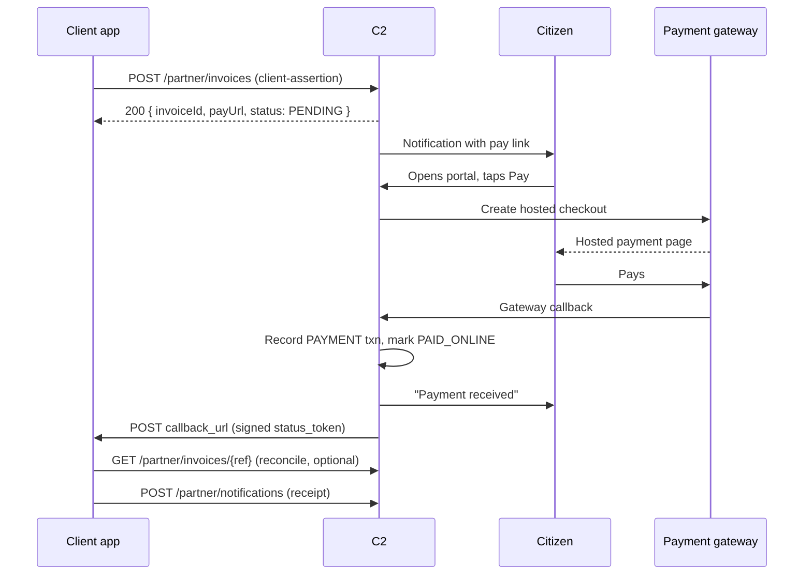

# Payment Broker — integrator guide

How a client application bills a citizen through C2 and learns when they've paid.
This is the on-the-wire contract; for the internal design see
[`Payment-Broker.md`](./Payment-Broker.md) and the build plan in
[`plan-payments.md`](../plan-payments.md).

## What C2 does for you

You raise an **invoice** against a citizen. C2 notifies them, hosts the checkout,
takes the payment on a PCI-compliant gateway, and tells you the result — signed,
so you can trust it without a shared secret. You never see card data and never
build a payment page.

```
 client app                     C2                         citizen
 ──────────                  ────────                    ──────────
    │  POST /partner/invoices   │                             │
    │ ─────────────────────────▶│  create PENDING invoice     │
    │  { invoiceId, payUrl }     │ ──── notify (pay link) ────▶│
    │ ◀─────────────────────────│                             │
    │                           │   ◀──── opens portal, Pay ──│
    │                           │   hosted gateway checkout ─▶ │
    │                           │   ◀──── gateway callback ────│
    │  POST callback_url         │  settle → PAID_ONLINE       │
    │ ◀───(signed status_token)─│ ──── "payment received" ───▶│
    │                           │                             │
```

If you don't register a `callback_url`, poll `GET /partner/invoices/{id}` for the
status instead — the push callback is a convenience, not the only way to know.

## Prerequisites

1. **A registered federation client** in C2 (the same client you'd use for OIDC),
   bound to your **application**. Your application id is your `service_provider_id`.
2. **Client authentication** — one of:
   - **`private_key_jwt`** (recommended): register a **JWKS URI** on your client;
     you sign a short assertion with your private key.
   - **HTTP Basic**: your `client_id` : `client_secret`.
3. **Citizen consent** — the citizen must have an **active link/consent** with
   your application (the same gate as partner notifications). Without it, billing
   is refused with `403`.

All amounts are **decimal strings** (`"15.75"`), never floats or minor units, and
every invoice carries an ISO‑4217 `currency`.

## Authentication

The partner API is a sibling of `/api` at **`{C2_ORIGIN}/partner`** and is
machine-authenticated per request — there is no session or CSRF.

### private_key_jwt (recommended)

Send a signed client-assertion JWT in the **`X-Client-Assertion`** header. Claims:

| Claim | Value |
|-------|-------|
| `iss` | your `client_id` |
| `sub` | your `client_id` |
| `aud` | `{C2_ORIGIN}` (the C2 issuer origin) |
| `iat` | now |
| `exp` | a few minutes out |
| `jti` | a unique id |

Sign with RS256 and a `kid` matching a key in **your** published JWKS. C2 fetches
your JWKS (by the registered URI), verifies the signature, and checks the claims.

```
X-Client-Assertion: eyJhbGciOiJSUzI1NiIsImtpZCI6…
```

### HTTP Basic (alternative)

```
Authorization: Basic base64(client_id:client_secret)
```

## Raise an invoice

`POST {C2_ORIGIN}/partner/invoices`

```jsonc
{
  "user_id": "b3f1…",              // citizen OIDC sub (required)
  "service_provider_id": "app-42", // must equal your application id (optional; validated if sent)
  "invoice_id": "INV-2026-000123", // YOUR invoice id — idempotency + correlation key (required)
  "currency": "CAD",               // ISO-4217 (required)
  "description": "Dog licence renewal",
  "callback_url": "https://billing.city.example/c2/payments",
  "items": [                       // at least one (required)
    { "description": "Annual licence", "amount": "35.00" },
    { "description": "Late fee",       "amount": "5.00"  }
  ],
  "tax": [
    { "name": "GST", "amount": "2.00" }
  ],
  "amount": "42.00"                // optional; if sent, MUST equal sum(items)+sum(tax)
}
```

- **Total** is computed server-side as `sum(items) + sum(tax)`. If you send
  `amount`, it must match exactly, or you get `400` — a guard against drift.
- **Idempotent** on `(application, invoice_id)`: repeating the same `invoice_id`
  returns the **existing** invoice unchanged (safe to retry).
- **Consent-gated**: if the citizen has no active consent with your application,
  you get `403` (audited).

**`200` response:**

```json
{
  "invoiceId": "9c2a…",                       // C2's invoice id
  "clientInvoiceRef": "INV-2026-000123",
  "status": "PENDING",
  "payUrl": "https://portal.city.example/my-services/payments?invoice=9c2a…",
  "total": { "amount": "42.00", "currency": "CAD" }
}
```

The citizen is notified automatically with the `payUrl`. You don't have to send
them anything, though you may include it in your own correspondence.

## Query invoice status

`GET {C2_ORIGIN}/partner/invoices/{ref}` — `{ref}` is C2's `invoiceId` **or** your
own `invoice_id`. You can only see invoices your application raised.

```json
{
  "invoiceId": "9c2a…",
  "clientInvoiceRef": "INV-2026-000123",
  "status": "PAID_ONLINE",
  "total": { "amount": "42.00", "currency": "CAD" },
  "gatewayTxnId": "ch_3P…",
  "paidAt": "2026-08-20T15:04:05Z"
}
```

Poll this if you didn't register a `callback_url`, or as a reconciliation backstop.

## The status callback (push)

When an invoice **settles** (`PAID_ONLINE`) or is later **refunded**, C2 POSTs to your `callback_url`:

```
POST {your callback_url}
Content-Type: application/x-www-form-urlencoded

status_token=eyJhbGciOiJSUzI1NiIsInR5cCI6InBheW1lbnQtc3RhdHVzK2p3dC…
```

`status_token` is an **RS256 JWT** signed with C2's OIDC signing key — the same
key that signs `id_token`s and `logout_token`s — so you verify it against C2's
**public JWKS**. No shared secret; the token's signature is the proof.

**Claims:**

| Claim | Meaning |
|-------|---------|
| `iss` | C2's OIDC issuer (`{C2_ORIGIN}/oidc`) |
| `aud` | your application id (the `service_provider_id`) |
| `sub` | the citizen's OIDC sub |
| `invoice_id` | C2's invoice id |
| `client_invoice_ref` | your `invoice_id` |
| `event` | `payment` or `refund` — which change triggered this callback |
| `event_amount` | the amount of **this** event (the payment, or the refund): `{ "amount": "10.00", "currency": "CAD" }` |
| `status` | the invoice status **after** the event: `PAID_ONLINE`, or `REFUNDED` once fully refunded (a partial refund leaves it `PAID_ONLINE`) |
| `amount` | the invoice **total** `{ "amount": "42.00", "currency": "CAD" }` |
| `payment_method` | e.g. `VISA` |
| `gateway_txn_id` | this event's gateway reference (the charge id, or the refund id) |
| `paid_at` | RFC 3339 timestamp of the original payment |
| `iat`, `exp`, `jti` | issued-at, short expiry (~2 min), unique id |

Branch on `event`: `payment` is a settlement; `refund` is a (possibly partial) reversal — reconcile `event_amount` against `status` (`REFUNDED` means fully refunded). A partial refund arrives as `event: "refund"` with `status: "PAID_ONLINE"`.

**To verify (do all of these):**

1. Fetch C2's JWKS from **`{C2_ORIGIN}/api/oauth2/jwks.json`** (discoverable via
   `{C2_ORIGIN}/oidc/.well-known/openid-configuration` → `jwks_uri`). Cache it and
   refresh on an unknown `kid` (keys rotate).
2. Verify the RS256 signature against the key whose `kid` matches the JWT header.
3. Check `iss` equals `{C2_ORIGIN}/oidc`, `aud` equals your application id, and
   `exp` is in the future.
4. Correlate on `client_invoice_ref` (your id) and treat as idempotent — a
   callback may be re-delivered; apply it once.

Respond **2xx** to acknowledge. Non-2xx is logged on the C2 side; delivery is
best-effort and detached (it never blocks the citizen's payment or an operator's
refund), so treat the poll endpoint as the source of truth for reconciliation.
Successful settlement and refunds are pushed; a failed online payment attempt
leaves the invoice `PENDING` for the citizen to retry (no callback).

## Issuing a receipt

C2 doesn't send a receipt on your behalf — you own the customer relationship. On a
verified callback, push your receipt to the citizen through the existing partner
notification endpoint:

`POST {C2_ORIGIN}/partner/notifications` (same auth, consent-gated) — subject,
body, and your application id. Include your invoice number and the
`gateway_txn_id` from the callback.

## Status reference

| Status | Meaning |
|--------|---------|
| `PENDING` | Raised, not yet paid. The citizen can pay it in the portal. |
| `PAID_ONLINE` | Paid via the hosted gateway. `gatewayTxnId` + `paidAt` set. |
| `PAID_AT_LOCATION` | Recorded as paid in person (staff-entered). |
| `CANCELLED` | Voided; no longer payable. |
| `REFUNDED` | Fully refunded (see the refunds phase). |

## Sequence



## End-to-end example

**1 — raise (private_key_jwt):**

```bash
curl -sS -X POST "$C2/partner/invoices" \
  -H "X-Client-Assertion: $ASSERTION_JWT" \
  -H "Content-Type: application/json" \
  -d '{
    "user_id": "b3f1…",
    "invoice_id": "INV-2026-000123",
    "currency": "CAD",
    "description": "Dog licence renewal",
    "callback_url": "https://billing.city.example/c2/payments",
    "items": [{ "description": "Annual licence", "amount": "42.00" }]
  }'
```

**2 — your callback handler (pseudocode):**

```
POST /c2/payments  (form: status_token)
  jwks   = cache_or_fetch("$C2/api/oauth2/jwks.json")
  claims = verify_rs256(status_token, jwks)          # signature + kid
  assert claims.iss == "$C2/oidc"
  assert claims.aud == MY_APPLICATION_ID
  assert claims.exp > now
  if already_applied(claims.client_invoice_ref): return 204   # idempotent
  mark_paid(claims.client_invoice_ref, claims.gateway_txn_id, claims.paid_at)
  return 204
```

**3 — reconcile / poll (no callback registered):**

```bash
curl -sS "$C2/partner/invoices/INV-2026-000123" -H "X-Client-Assertion: $ASSERTION_JWT"
# → { "status": "PAID_ONLINE", "gatewayTxnId": "…", "paidAt": "…" }
```

## Notes & guarantees

- **No card data reaches C2 or you** — payment happens on the gateway's hosted
  page (PCI‑DSS stays with the gateway).
- **Idempotency everywhere** — raising is idempotent on your `invoice_id`;
  settlement and its callback are idempotent on the invoice. Retry freely.
- **Amounts are decimal strings**; C2 computes the total and rejects a mismatched
  client‑supplied `amount`.
- **Callbacks are advisory** — always able to fall back to the query endpoint;
  never assume a callback arrived to consider a payment reconciled.
- **One city merchant** — every payment settles to the city's gateway account;
  `service_provider_id` is a reporting dimension, not a settlement target.
